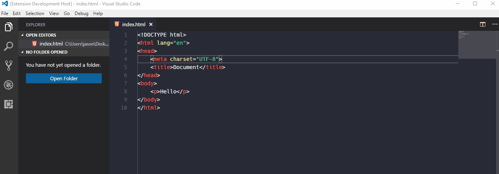
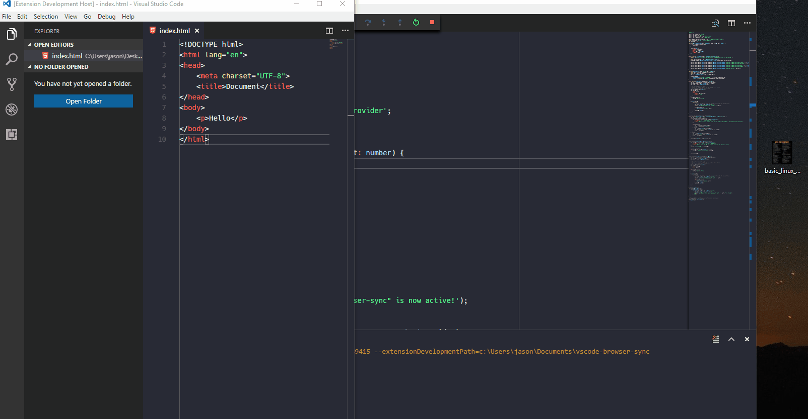
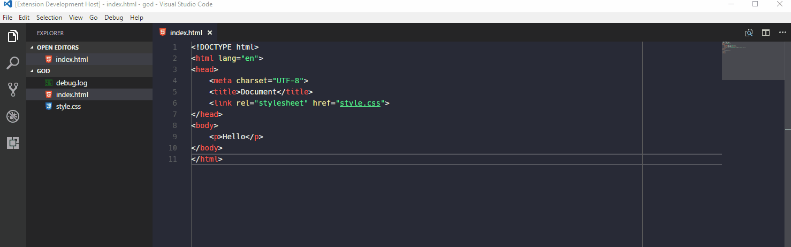
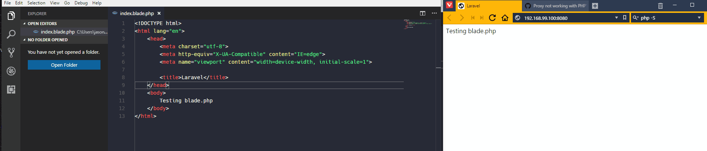

# Objective

Some of my friends ask me for similar requrest so I create this extension. It aims to integrate browser sync with VSCode to provide live preview of website

# Requirement

- Just *VSCode*
- A web server supports proxy, [php -S seems to has some issues with localhost](https://github.com/BrowserSync/browser-sync/issues/335)

It can run without installing [browser-sync](https://www.browsersync.io) and `Node.js` runtime becasues the extension containing the codes of **browser-sync** is running on a separated extension host node process.

# Features

 Although many enhancements can be done, the basic functions are finished. For any issue, you can leave a comment below or leave a issue at github. 

## Behaviour

The preview can be opened at the right panel and in the default browser in different command, and there are two modes: Server mode and Proxy mode.

- Server mode: static `html` file
- Proxy mode: dynamic website that has its own web server, such as `php`, `jsp`, `asp` etc ... 

**With opening or Without opening folder**

- With opening folder: watch the files you input in inputbox relative to the root folder
- Without opening folder: watch all files with the same extension at the parent folder of opening document

## Server Mode

**Without opening a folder**



1. Type command on a `html` file: `Browser Sync: Server mode at side panel`
2. Right panel will be opened with a web page enabling browser sync
3. Once you save your change, the right panel will be changed. This feature also works if you enable auto save feature in VSCode.

*You can also try the browser mode by command:* `Browser Sync: Server mode in browser`



**With opening a folder**



1. Type command on a `html` file: `Browser Sync: Server mode at side panel`
2. Type the path of files you want to watch relative to the root folder

## Proxy Mode

**Without opening a folder**

The image below is a **Laravel** web application hosted on a docker machine, the guideline don't just applies for **Laravel**, this also applied for other web application.



1. Type command on any kind of file: `Browser Sync: Proxy mode at side panel`
2. Type in the URL of the original website, e.g. `http://localhost:8080`, or `8080`

**With opening a folder**

1. Type command on any kind of file: `Browser Sync: Proxy mode at side panel`
2. Type in the URL of the original website, e.g. `http://localhost:8080`, or `8080`
3. Type the path of files you want to watch relative to the root folder

# Configuration

Add setting as JSON format into user setting or workspace setting to override default behaviour. The setting options come from [here](https://www.browsersync.io/docs/options), please use the option for Browser Sync version `2.18.13`

Example setting:
- Open in different browser: chrome and firefox
- Without code sync.

[Note from issue](https://github.com/Jasonlhy/VSCode-Browser-Sync/issues/1): Use "google chrome" under window, "chrome" under Mac

```json
"browserSync.config" : {
   "browser" : ["chrome", "firefox"],
   "codeSync" : false
}
```

# How it works

## Static HTML file

1. Once the command is typed, a `Node.js` server will be started, it handle request of the HTML file, and listen to the changes of files.
2. The right panel is a static HTML page but it looks like an embedded browser by containing an iframe with `src` pointing to the URL of the HTML file.
3. Once the file is saved, the server notifies the website embedded inside the iframe.

## Proxy for dynamic site

1. Once the command is typed, a `Node.js` proxy will be started, it forward your request to the target URL with injecting the script in the returned HTML.
2. The right panel is a static HTML page but it looks like an embedded browser by containing an iframe with `src` pointing to the URL of the proxy server.
3. Once the file is saved, the server notifies the proxy server embedded inside the iframe.

# Enhancement Planning

1. Better resource management
2. Provide Better message to end user
3. Better error handling