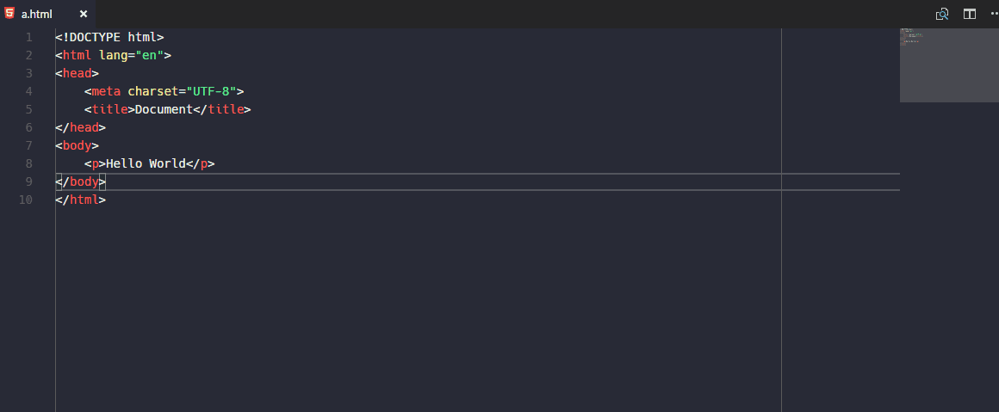

# Objective

Integrate browser sync with VSCode to provide liveload

# Requirement

It calls a `Node.js` library [browser-sync](https://www.browsersync.io) as command line process so you need to install the `Node.js` runtime from [here](https://nodejs.org/)

I have tested on `Node.js` v6.9.1 on Windows, and `v4.2.6` on Linux. It seems to work without problem.

# Features

This extensions is stil a prototype in Beta version. But you can try its function

1. Type command on a HTML file: `Side Panel: browser sync`
2. Right panel will be opened with a web page enabling browser sync
3. Once you save your change, the right panel will be changed. This feature also works if you enable auto save feature in VSCode.

# How it works

[TODO]

# Enhancement

1. Listen to more files not just `*.html`
2. Folder level setting
3. Start proxy for dynamic sites
4. Use native `browser-sync` API instead of `child_process` (I tried but I don't know why It doesn't work)
5. Use Better method to get the port number
6. Better resource management